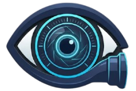

<div align="center">



# Privacy Lens

**A dynamic privacy shield for Chrome — work on sensitive content in public without exposing your screen.**

[](https://github.com/m2l33k/Privacy-Lens/actions/workflows/build.yml)
[](./manifest.json)
[](./manifest.json)
[](#)

</div>

---

## How It Works

Activating **Privacy Mode** blurs the entire browser tab with a frosted-glass overlay. A clear **Lens** follows your cursor, revealing only what you're focused on. Everything outside stays hidden. Panic-toggle it instantly with a hotkey the moment someone looks your way.

---

## Screenshots

> Add GIFs or images here once available — drag and drop into the GitHub editor.

| Lens active | Effects grid | Stats page |
|:-----------:|:------------:|:----------:|
| _screenshot_ | _screenshot_ | _screenshot_ |

---

## Table of Contents

- [Install](#install)
- [Features](#features)
  - [Lens Shape & Size](#-lens-shape--size)
  - [Visual Controls](#-visual-controls)
  - [Effects](#-effects)
  - [Interaction](#-interaction)
  - [Security & Automation](#-security--automation)
  - [Profiles & Settings](#-profiles--settings)
  - [Stats](#-stats)
- [Popup Layout](#popup---3-tab-layout)
- [Hotkeys](#hotkeys)
- [Development](#development)
- [Architecture](#architecture)

---

## Install

```bash
npm install && npm run build
```

1. Open Chrome → `chrome://extensions`
2. Enable **Developer mode** (top-right toggle)
3. Click **Load unpacked** → select the `dist/` folder
4. The Privacy Lens icon appears in your toolbar

---

## Features

### 🔵 Lens Shape & Size

| Feature | Description |
|---|---|
| **6 lens shapes** | Rect, Circle, Spotlight, Hexagon, Diamond, Star |
| **Spotlight mode** | Soft radial vignette — no hard edge, no border |
| **Polygon shapes** | Hexagon, Diamond, Star via `clip-path: path(evenodd, ...)` |
| **4 size presets** | Micro 60×60 · Text 420×32 · Social 320×320 · Wide 700×400 |
| **Free resize** | 8 corner/edge drag handles on the lens border |
| **Shift + Drag** | Draw a custom lens area with the mouse |
| **Ctrl + Scroll** | Resize the lens without opening the popup |

---

### 🎨 Visual Controls

| Feature | Description |
|---|---|
| **Blur intensity** | Adjustable 4px – 40px slider |
| **Overlay darkness** | Controls how dark the blurred area is |
| **Border thickness** | 1 – 6px slider — hairline to bold frame |
| **Film grain** | Animated SVG turbulence noise texture on the blur area |
| **LERP tracking** | Smooth 60fps cursor follow |
| **Lock Lens** | Freeze the lens in place — stops following cursor |

---

### ✨ Effects

| Effect | Style |
|---|---|
| **Cyan** | Default cyan glow — customizable via color picker |
| **Fire** | Animated orange flame glow + spark particles |
| **Neon** | Pulsing green/purple neon border |
| **Ice** | Cool blue crystalline shimmer |
| **Ghost** | Subtle translucent white border |
| **Police** | Alternating red/blue strobe light |
| **Torch** | Warm flashlight — darkens everything, lens is the light source |
| **Matrix** | Green scanlines + digital rain tint |
| **CCTV** | Scanlines + blinking REC dot + live timestamp |

---

### 🖱️ Interaction

| Shortcut | Action |
|---|---|
| `Alt + X` | Panic toggle (remappable) |
| `Ctrl + Scroll` | Resize lens |
| `Shift + Drag` | Draw custom lens area |
| `Middle Click` | Lock / unlock lens |
| Right-click | "Toggle Privacy Lens" context menu on any page |
| Timer mode | Auto-deactivate after N minutes with HUD countdown |
| Idle detection | Auto-activate after cursor inactivity for N seconds |

---

### 🔒 Security & Automation

| Feature | Description |
|---|---|
| **Screen Guard** | Auto-activates when tab is hidden or screen sharing starts |
| **Webcam Guard** | Auto-activates when camera or microphone access begins |
| **Clipboard Guard** | Brief 10-second activation when content is pasted |
| **Work Hours Scheduler** | Auto-activate on configurable days + time range |
| **Auto-Activate per Site** | Remembers Privacy Mode state for a domain |
| **Panic Sound** | Web Audio API tone on activate / deactivate (toggleable) |

---

### 💾 Profiles & Settings

| Feature | Description |
|---|---|
| **Quick Profiles** | Work, Cafe, Meeting presets — save and restore a full configuration |
| **Export Settings** | Download all settings as a JSON backup |
| **Import Settings** | Restore settings from a JSON backup |
| **Lens Color** | Color picker to customize the Cyan effect accent |

---

### 📊 Stats

| Feature | Description |
|---|---|
| **Weekly stats page** | Opens in a new tab from the popup header |
| **Summary cards** | Today · This week · All-time minutes · Session count · Day streak |
| **Day streak** | Consecutive days Privacy Mode was used |
| **Daily bar chart** | Last 7 days usage visualization |
| **Effect breakdown** | Color-coded bars by effect |
| **Top sites** | Ranked by time protected |
| **Session history** | Scrollable log of last 20 sessions (date / site / effect / duration) |
| **Export CSV** | Download all stats as a CSV file |

---

## Popup — 3-Tab Layout

### Lens tab
Privacy Mode toggle → Shape selector → Size presets → Effect picker → Blur / Darkness / Border sliders → Film Grain toggle → Lock Lens → Hotkey reference

### Schedule tab
Enable/disable work hours, pick active days (Mon–Sun), set start and end time.

### Settings tab

| Setting | Description |
|---|---|
| Lens Color | Customize the Cyan effect accent color |
| Panic Hotkey | Click Change, press any key combo to remap |
| Auto-Deactivate Timer | Off / 1 / 2 / 5 / 10 / 15 / 30 min |
| Idle Auto-Activate | Off / 30 s / 1 / 2 / 5 / 10 min |
| Screen Guard | Auto-activate on screen share / tab hide |
| Webcam Guard | Auto-activate when camera activates |
| Clipboard Guard | Brief 10 s activate on paste |
| Panic Sound | Toggle the activation tone |
| Quick Profiles | Load / Save Work, Cafe, Meeting presets |
| Auto-Activate | Remember Privacy Mode for this domain |
| Export / Import | JSON settings backup and restore |

---

## Hotkeys

| Shortcut | Action |
|---|---|
| `Alt + X` | Panic toggle (remappable in Settings) |
| `Ctrl + Scroll` | Resize lens |
| `Shift + Drag` | Draw custom lens area |
| `Middle Click` | Lock / unlock lens |

---

## Development

```bash
npm install
npm run dev      # watch mode (webpack --watch)
npm run build    # production build → dist/
```

> After making changes, go to `chrome://extensions` and click the **refresh icon** on the Privacy Lens card. No need to re-add — just reload.

---

## Architecture

```
src/
├── content/
│   └── content.js        Blur overlay · lens geometry · LERP tracking
│                         8 resize handles · 9 effects · polygon shapes
│                         spotlight mode · grain overlay · guards
│                         timer · idle · scheduler · stats · profiles
├── popup/
│   ├── index.jsx          React 18 entry
│   ├── App.jsx            3-tab popup UI (Lens / Schedule / Settings)
│   └── styles.css         Dark glassmorphism design system
├── stats/
│   ├── stats.html         Standalone stats page
│   ├── index.jsx          React 18 entry
│   ├── App.jsx            Charts · streak · CSV export · session history
│   └── stats.css          Stats page styles
└── background/
    └── background.js      MV3 service worker · context menu · profile
                           defaults · popup → content message relay
```

### Key technical decisions

**Blur rendering** — `backdrop-filter: blur()` + CSS `mask-image` with `linear-gradient` layers (rect) or `radial-gradient` (circle / spotlight). CSS custom properties `--lx`, `--ly`, `--lw`, `--lh` are updated every animation frame. SVG masks were tested and abandoned due to CSP/compositing issues in Chrome extensions.

**Polygon shapes** — `clip-path: path(evenodd, ...)` with absolute viewport coordinates rebuilt every frame. SVG borders for polygons use a permanent full-page `<svg>` element animated via CSS `@keyframes` on `stroke` and `filter: drop-shadow()`.

**Click passthrough** — Four transparent blocking panels surround the lens with no element over the lens center, so clicks reach the page natively. Panels are disabled for spotlight and polygon shapes.

**Persistence** — Site-specific settings (effect, blur, shape, opacity, thickness, grain) are saved per-hostname. Global settings (hotkey, sound, guards, scheduler, timer, idle) are saved to `globalSettings`. Profiles are stored under `pl_profiles` in `chrome.storage.local`.

**Stats** — Stored as a `__pl_sessions__` array (max 200 entries) with `{ site, effect, date, minutes }` per session.
